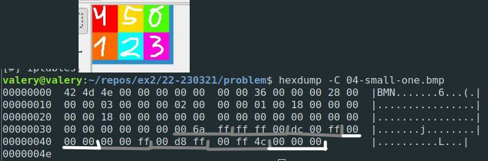

# Общее

Цель занятия: попрактиковаться с динамическими библиотеками и подготовиться к домашке про BMP.

# Базовые упражнения (`0x`)
## `01-dynamic-libraries`
Попросите семинариста рассказать про динамические библиотеки.

## `02-dlopen`
На языке Си, загрузите в вашу программу разделяемую библиотеку `libm` (**m**ath, библиотека с математическими функциями), а потом выгрузите её. Убедитесь, что вы корректно обрабатываете всевозможные ошибки, и сообщаете о них пользователю.

Для точного API см. [man dlopen](https://man7.org/linux/man-pages/man3/dlopen.3.html).

Скорее всего, на вашей системе, `libm` лежит в папке `/lib/x86_64-linux-gnu` (Ubuntu) или `/usr/lib` (MacOS). Также, для компиляции с использованием библиотеки `dl`, понадобится флаг `-ldl`. 

## `03-dlsym`
На языке Си, используя ваше решение предыдущего упражнения, напишите небольшую программу, считывающую число `n` - количество различных функций типа `double(*)(double)`, которые необходимо вызвать. В следующих `n` строчках перечисленны две строки и одно дробное число, разделённые пробелом: полный путь до разделяемой библиотеки, название функции типа `double(*)(double)` из этой разделяемой библиотеки и аргумент для функции. 

Вызовите каждую функцию из своей разделяемой библиотеки с нужным аргументом, а результат выведите на экран.

Например, на Ubuntu при таком вводе:
```
2
/lib/x86_64-linux-gnu/libm.so sin 3.141593
/lib/x86_64-linux-gnu/libm.so acos -1.0
```

Следует такой вывод:
```
-0.000000
3.141593
```

Убедитесь, что у вас нет никаких утечек.

Для точного API см. [man dlsym](https://man7.org/linux/man-pages/man3/dlsym.3.html).

# Для домашки (`1x`)
## `10-bmp-hw`
Попросите семинариста рассказать про тестирование и поспойлерить вам домашку про BMP.


